# Proyecto 14: Task Me! - Backend

## Descripción del Proyecto

**Task Me** es una aplicación que ayuda a pequeños emprendedores, personas con algún oficio o quienes buscan generar ingresos extra. Este proyecto representa el backend de la aplicación desde un enfoque académico, desarrollado como proyecto final del curso de **Programación N-Capas**.

### ✨ Características destacadas:

1. **Creación de perfiles según rol**:  
   Los usuarios pueden crear su perfil y elegir si lo harán como usuario normal (cliente) o como "Tasker", es decir, alguien que ofrece servicios dentro de la plataforma.

2. **Autenticación de usuarios con JWT**:  
   La navegación por las rutas protegidas de la API requiere un token **JWT**, el cual se obtiene al iniciar sesión o registrarse.

3. **Protección de endpoints mediante JWT**:  
   Todos los endpoints, excepto los de login, registro y los `GET ALL` públicos (como los de categoría y ubicación), están protegidos usando **autenticación basada en tokens JWT**.

4. **Restricción de acceso según roles**:  
   Algunos endpoints solo están disponibles para ciertos roles. Por ejemplo, solo los "Taskers" pueden publicar trabajos previos, y únicamente usuarios con permisos especiales (como administradores) pueden crear categorías o ubicaciones. Esto asegura un control de acceso claro dentro de la aplicación.

5. **Respuestas personalizadas**:  
   La aplicación implementa un sistema de respuestas personalizadas para mejorar la comunicación con el cliente.  
   Cada respuesta, ya sea exitosa o con error, incluye información útil como:

   - La **ruta** solicitada
   - La **fecha y hora** de la petición
   - El **estado** (éxito o error)
   - Un **mensaje claro**
   - Y, cuando aplica, los **datos solicitados o procesados**

   Esto permite un manejo más eficiente y estandarizado de las respuestas en toda la API.

6. **Enfoque en arquitectura N-Capas**:  
   Al tratarse de un proyecto para la materia, se aplicó una arquitectura bien estructurada y separada en capas.  
   Cada paquete tiene una responsabilidad clara, manteniendo el orden y la escalabilidad del sistema:

   - **`entity`**: Para la creación de la BD, definiendo los modelos de los datos.
   - **`dto`**: Para dar más personalización a las respuestas, separados por `request` (peticiones) y `response` (respuestas).
   - **`mapper`**: Para convertir entre entidades y DTOs de forma segura.
   - **`repository`**: Para crear las consultas que obtendrán, actualizarán, guardarán o eliminarán en la BD.
   - **`service`**: Para aplicar las reglas de negocio sobre los datos recibidos o enviados.
   - **`controller`**: Para comunicarse con el cliente y manejar las peticiones o respuestas.
   - **`exception`**: Para manejar errores personalizados, mejorando el control de errores de la app.
   - **`config`**: Para configurar el proyecto en cuanto a seguridad, CORS y otros detalles generales.
   - **`utils`**: Funciones o clases de utilidad usadas en distintos puntos de la aplicación.

## Tecnologias Utilizadas

    
    
    

## Endpoints

Puedes consultar y probar los endpoints de esta API usando la siguiente colección de [Insomnia](https://github.com/Calderon2307/Portafolio_Web/blob/main/Backend_TaskMe/src/main/resources/TaskMe_Collection.yaml) que incluye todas las rutas disponibles organizadas por módulos.

## Ejemplos de peticiones y respuestas

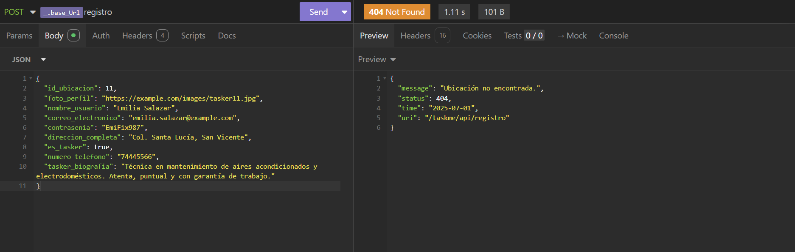
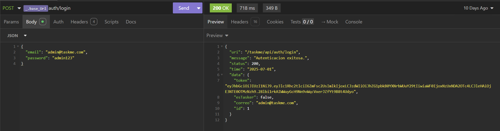
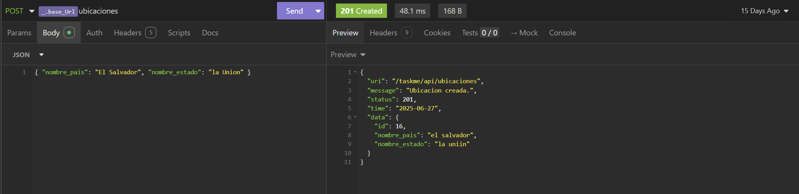
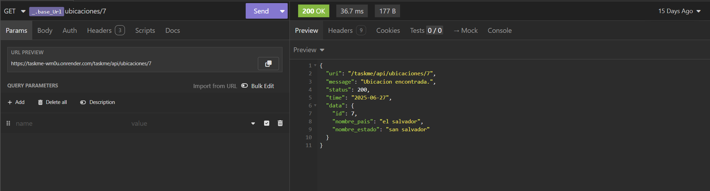
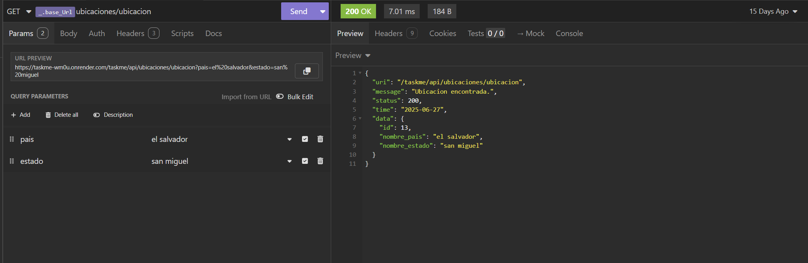
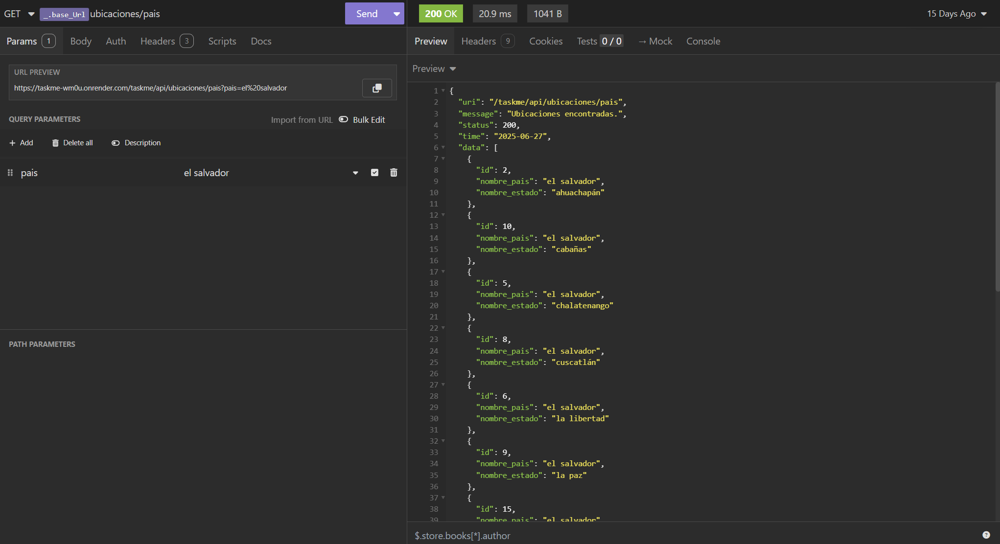
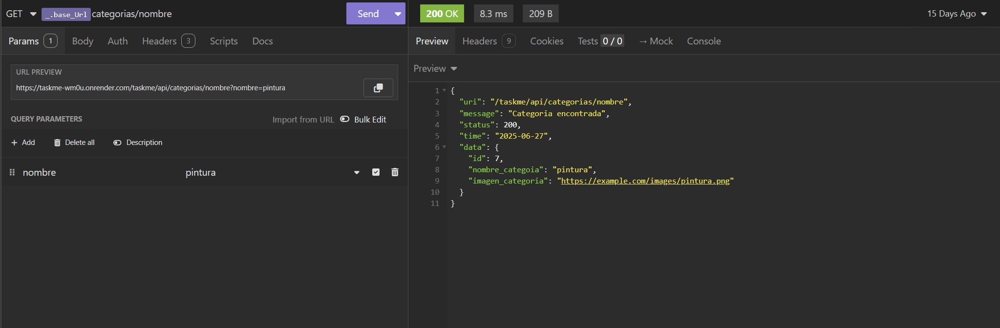
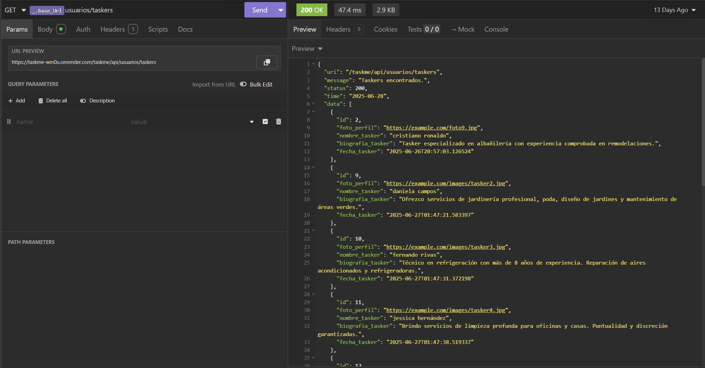
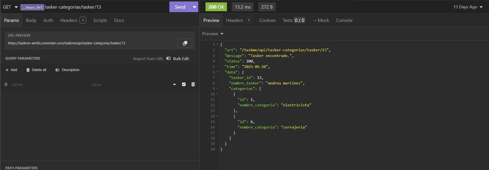
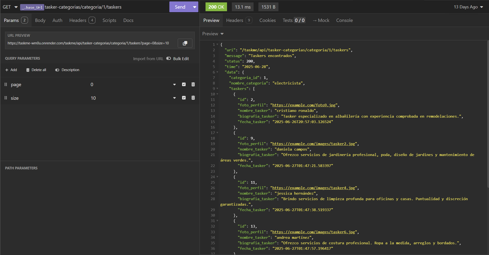
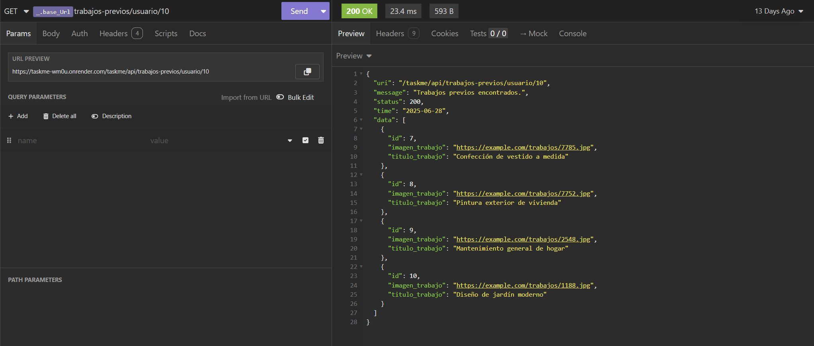
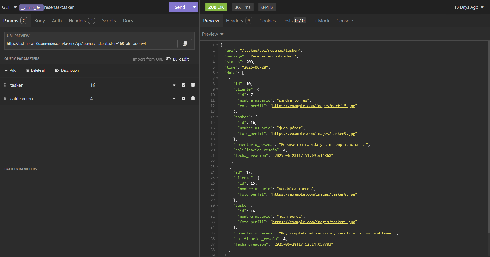
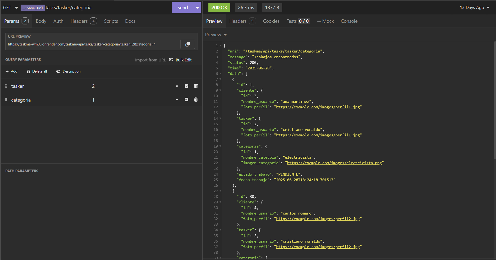

## Instrucciones de Instalación

## Otros Proyectos

- [Proyecto 1: Create Elements](https://github.com/Calderon2307/Portafolio_Web/tree/main/Frontend_Create-Elements): Contiene el código y recursos relacionados con el Proyecto 1.
- [Proyecto 2: Animaciones CSS](https://github.com/Calderon2307/Portafolio_Web/tree/main/Frontend_Curso-CSS_Animaciones): Contiene el código y recursos relacionados con el Proyecto 2.
- [Proyecto 3: Primera Web](https://github.com/Calderon2307/Portafolio_Web/tree/main/Frontend_Curso-CSS_Primera-Web): Contiene el código y recursos relacionados con el Proyecto 3.
- [Proyecto 4: Luxury Cars](https://github.com/Calderon2307/Portafolio_Web/tree/main/Frontend_Luxury-Cars): Contiene el código y recursos relacionados con el Proyecto 4.
- [Proyecto 5: Nasa API JS](https://github.com/Calderon2307/Portafolio_Web/tree/main/Frontend_Nasa-API_JS): Contiene el código y recursos relacionados con el Proyecto 5.
- [Proyecto 6: Nasa API React](https://github.com/Calderon2307/Portafolio_Web/tree/main/Frontend_Nasa-API_React): Contiene el código y recursos relacionados con el Proyecto 6.
- [Proyecto 7: Pokedex JS](https://github.com/Calderon2307/Portafolio_Web/tree/main/Frontend_Pokedex_JS): Contiene el código y recursos relacionados con el Proyecto 7.
- [Proyecto 8: Sabores en Reserva](https://github.com/Calderon2307/Portafolio_Web/tree/main/Frontend_Proyecto_Sabores-En-Reserva_React): Contiene el código y recursos relacionados con el Proyecto 8.
- [Proyecto 9: Questions API JS](https://github.com/Calderon2307/Portafolio_Web/tree/main/Frontend_Questions-API_JS): Contiene el código y recursos relacionados con el Proyecto 9.
- [Proyecto 10: Questions API React](https://github.com/Calderon2307/Portafolio_Web/tree/main/Frontend_Questions-API_React): Contiene el código y recursos relacionados con el Proyecto 10.
- [Proyecto 11: The Space](https://github.com/Calderon2307/Portafolio_Web/tree/main/Frontend_The-Space): Contiene el código y recursos relacionados con el Proyecto 11.
- [Proyecto 12: Simple Calculator](https://github.com/Calderon2307/Portafolio_Web/tree/main/Simple-Calculator): Contiene el código y recursos relacionados con el Proyecto 12.
- [Proyecto 13: Pokedex - V2](https://github.com/Calderon2307/Portafolio_Web/tree/main/Frontend_PokedexV2_React): Contiene el código y recursos relacionados con el Proyecto 13.
