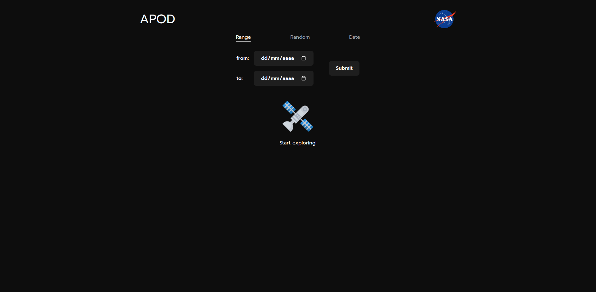
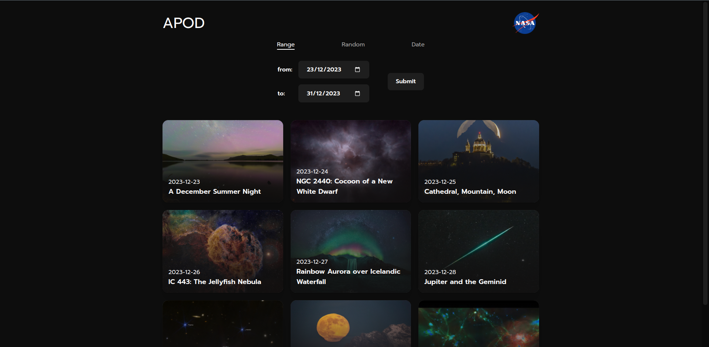
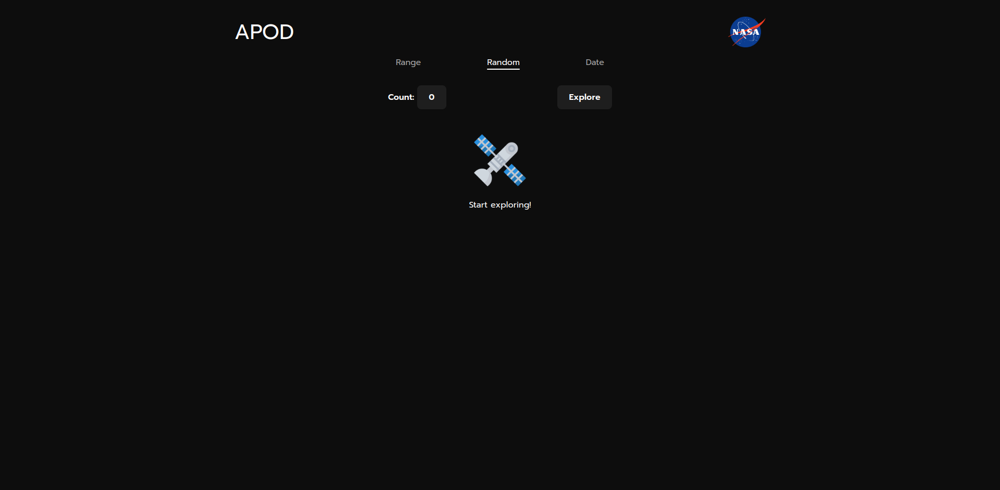
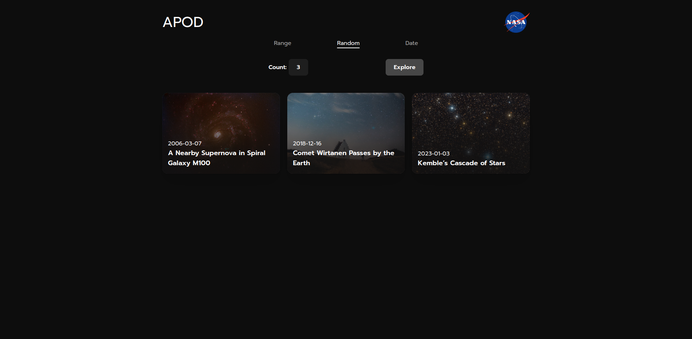
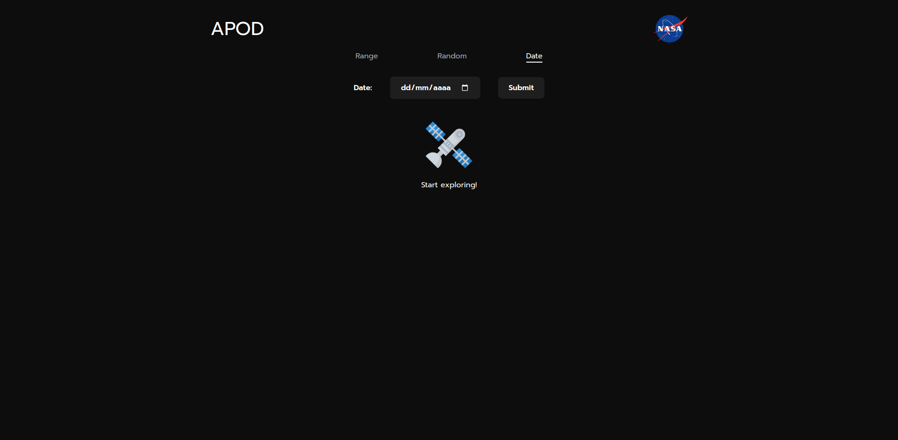
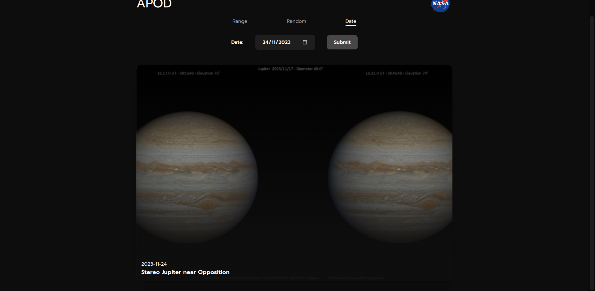
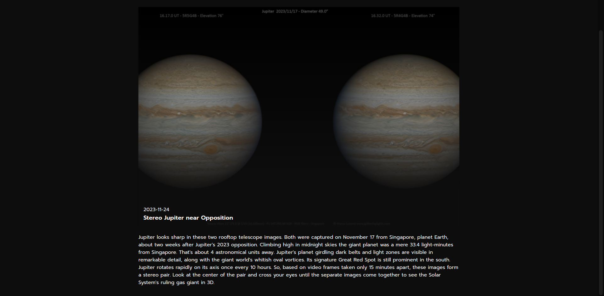

# Proyecto 5: Nasa API (JS)

## Descripción del Proyecto

El proyecto "NASA API con JavaScript" es una aplicación frontend diseñada para consumir la API de la NASA y ofrecer una experiencia visual atractiva al usuario. La aplicación permite acceder a imágenes aleatorias, así como seleccionar imágenes correspondientes a una fecha específica o un rango de fechas. Esta aplicación destaca por su capacidad para interactuar con la API de la NASA de manera eficiente y presentar visualmente los resultados de manera intuitiva, utilizando únicamente JavaScript para la lógica y manipulación del DOM.

## Capturas de Pantalla

## Tecnologías Utilizadas

    
    
    

## Instrucciones de Instalación

- Clonar el repositorio "[https://github.com/Calderon2307/Portafolio_Web](https://github.com/Calderon2307/Portafolio_Web)".
- Acceder a la carpeta "Frontend_Nasa-API_JS".
- Abrir el archivo "index.html" en el navegador.

## Historial de Cambios (Commits)

Para visualizar el historial de commits visitar [este link](https://github.com/Programacion-Web-02-2023/portafolio-Calderon2307/commits/master/Laboratorios/Laboratorio-07?author=Calderon2307)

## Otros Proyectos

- [Proyecto 1: Create Elements](https://github.com/Calderon2307/Portafolio_Web/tree/main/Frontend_Create-Elements): Contiene el código y recursos relacionados con el Proyecto 1.
- [Proyecto 2: Animaciones CSS](https://github.com/Calderon2307/Portafolio_Web/tree/main/Frontend_Curso-CSS_Animaciones): Contiene el código y recursos relacionados con el Proyecto 2.
- [Proyecto 3: Primera Web](https://github.com/Calderon2307/Portafolio_Web/tree/main/Frontend_Curso-CSS_Primera-Web): Contiene el código y recursos relacionados con el Proyecto 3.
- [Proyecto 4: Luxury Cars](https://github.com/Calderon2307/Portafolio_Web/tree/main/Frontend_Luxury-Cars): Contiene el código y recursos relacionados con el Proyecto 4.
- [Proyecto 6: Nasa API React](https://github.com/Calderon2307/Portafolio_Web/tree/main/Frontend_Nasa-API_React): Contiene el código y recursos relacionados con el Proyecto 6.
- [Proyecto 7: Pokedex JS](https://github.com/Calderon2307/Portafolio_Web/tree/main/Frontend_Pokedex_JS): Contiene el código y recursos relacionados con el Proyecto 7.
- [Proyecto 8: Sabores en Reserva](https://github.com/Calderon2307/Portafolio_Web/tree/main/Frontend_Proyecto_Sabores-En-Reserva_React): Contiene el código y recursos relacionados con el Proyecto 8.
- [Proyecto 9: Questions API JS](https://github.com/Calderon2307/Portafolio_Web/tree/main/Frontend_Questions-API_JS): Contiene el código y recursos relacionados con el Proyecto 9.
- [Proyecto 10: Questions API React](https://github.com/Calderon2307/Portafolio_Web/tree/main/Frontend_Questions-API_React): Contiene el código y recursos relacionados con el Proyecto 10.
- [Proyecto 11: The Space](https://github.com/Calderon2307/Portafolio_Web/tree/main/Frontend_The-Space): Contiene el código y recursos relacionados con el Proyecto 11.
- [Proyecto 12: Simple Calculator](https://github.com/Calderon2307/Portafolio_Web/tree/main/Simple-Calculator): Contiene el código y recursos relacionados con el Proyecto 12.
- [Proyecto 13: Pokedex - V2](https://github.com/Calderon2307/Portafolio_Web/tree/main/Frontend_PokedexV2_React): Contiene el código y recursos relacionados con el Proyecto 13.
- [Proyecto 14: Task Me! - Backend](https://github.com/Calderon2307/Portafolio_Web/tree/main/Backend_TaskMe): Contiene el código y recursos relacionados con el Proyecto 14.
