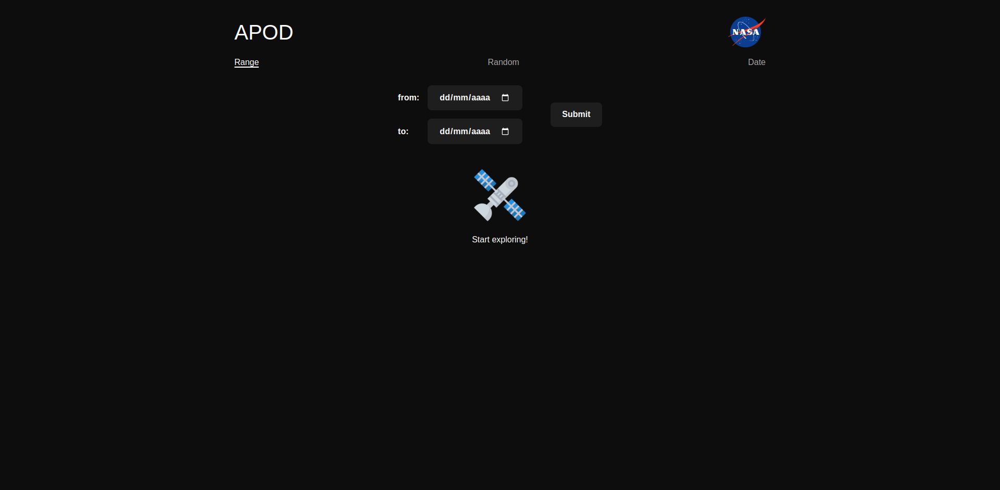
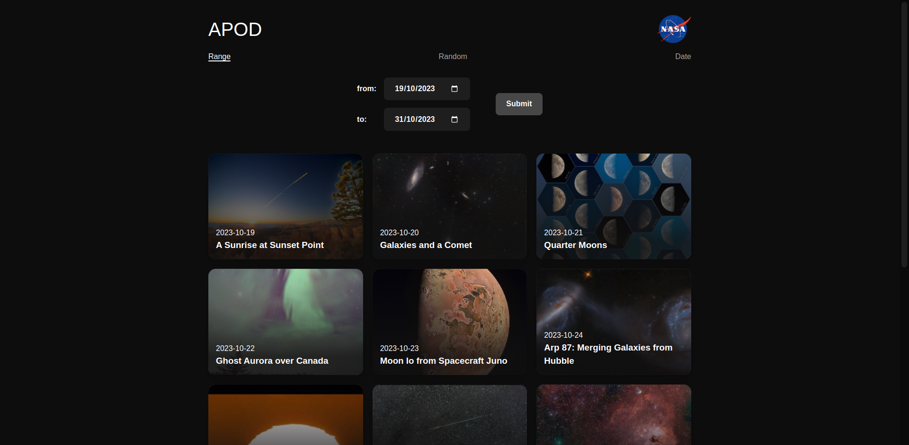
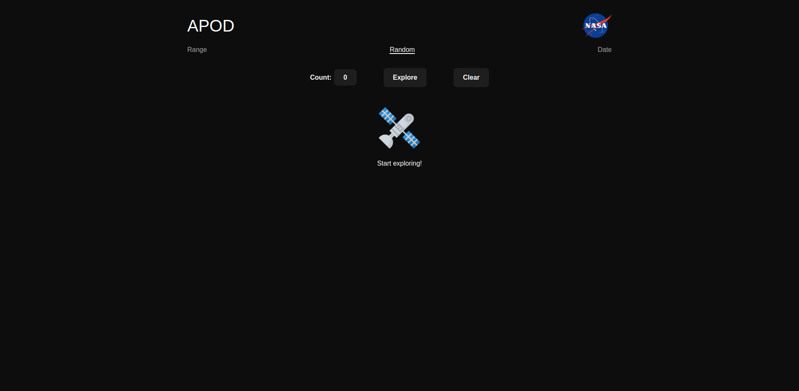
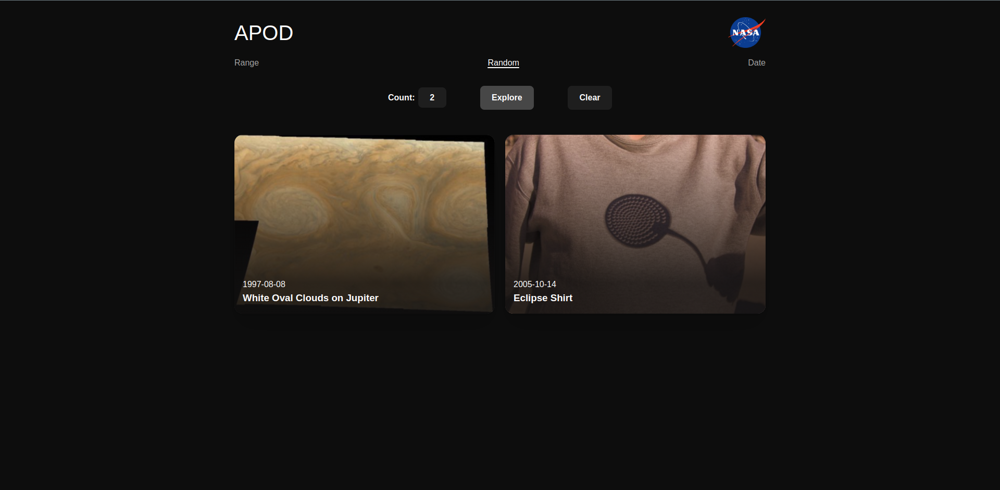
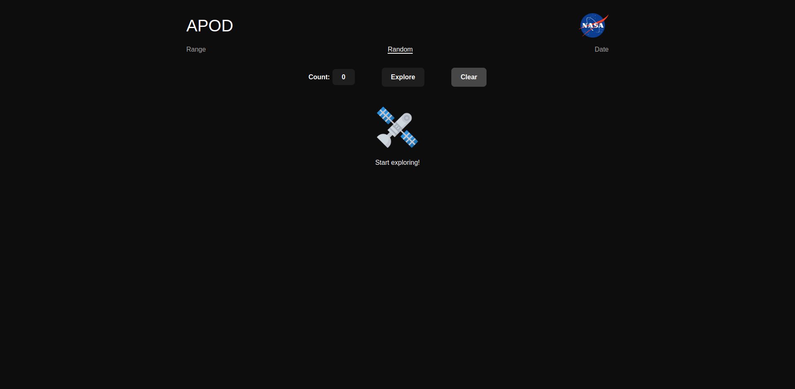
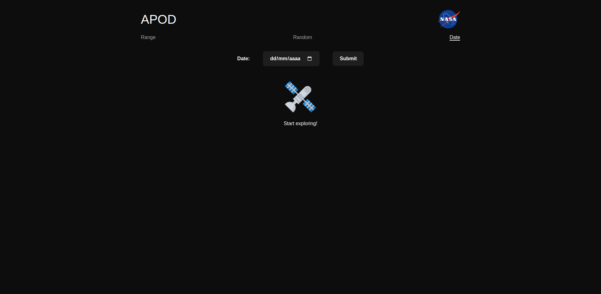
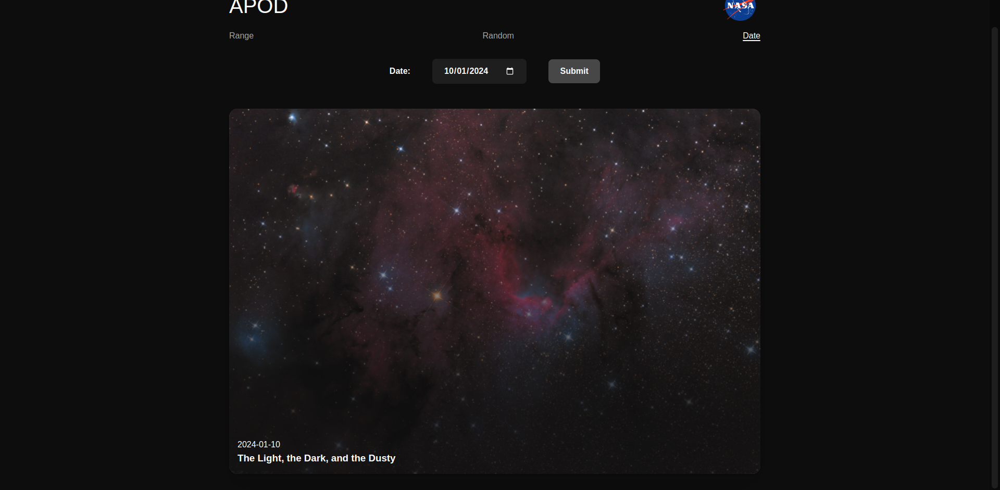

# Proyecto 6: Nasa API (React)

## Descripción del Proyecto

El proyecto "NASA API con React" es una aplicación frontend construida con React y Vite, diseñada para consumir la API de la NASA y proporcionar una experiencia interactiva al usuario. Esta aplicación ofrece tres vistas distintas: una para mostrar imágenes aleatorias, otra para visualizar la imagen correspondiente a una fecha específica, y una tercera para presentar imágenes en un rango de fechas. React Router se utiliza para gestionar la navegación entre estas vistas de manera eficiente.

La aplicación destaca por su estructura modular, utilizando componentes de React para cada sección funcional y proporcionando una navegación suave entre las diferentes páginas. El proyecto utiliza Vite como entorno de desarrollo rápido para React y Yarn como gestor de paquetes.

## Capturas de Pantalla

## Tecnologías Utilizadas

  

    
    
    
    
    
    
  

## Instrucciones de Instalación

- Clonar el repositorio "[https://github.com/Calderon2307/Portafolio_Web](https://github.com/Calderon2307/Portafolio_Web)".
- Acceder a la carpeta "Frontend_Nasa-API_React".
- Abrir el proyecto en una terminal.
- Installar yarn mediante el comando "yarn install".
- Ejecutar el comando "yarn dev".
- Click derecho en el enlace que aparece.
- Seleccionar la opcion "Abrir enlace".

## Historial de Cambios (Commits)

Para poder visualizar el historial de commits visitar [este link](https://github.com/Programacion-Web-02-2023/portafolio-Calderon2307/commits/master/Laboratorios/Laboratorio-08)

## Otros Proyectos

- [Proyecto 1: Create Elements](https://github.com/Calderon2307/Portafolio_Web/tree/main/Frontend_Create-Elements): Contiene el código y recursos relacionados con el Proyecto 1.
- [Proyecto 2: Animaciones CSS](https://github.com/Calderon2307/Portafolio_Web/tree/main/Frontend_Curso-CSS_Animaciones): Contiene el código y recursos relacionados con el Proyecto 2.
- [Proyecto 3: Primera Web](https://github.com/Calderon2307/Portafolio_Web/tree/main/Frontend_Curso-CSS_Primera-Web): Contiene el código y recursos relacionados con el Proyecto 3.
- [Proyecto 4: Luxury Cars](https://github.com/Calderon2307/Portafolio_Web/tree/main/Frontend_Luxury-Cars): Contiene el código y recursos relacionados con el Proyecto 4.
- [Proyecto 5: Nasa API JS](https://github.com/Calderon2307/Portafolio_Web/tree/main/Frontend_Nasa-API_JS): Contiene el código y recursos relacionados con el Proyecto 5.
- [Proyecto 7: Pokedex JS](https://github.com/Calderon2307/Portafolio_Web/tree/main/Frontend_Pokedex_JS): Contiene el código y recursos relacionados con el Proyecto 7.
- [Proyecto 8: Sabores en Reserva](https://github.com/Calderon2307/Portafolio_Web/tree/main/Frontend_Proyecto_Sabores-En-Reserva_React): Contiene el código y recursos relacionados con el Proyecto 8.
- [Proyecto 9: Questions API JS](https://github.com/Calderon2307/Portafolio_Web/tree/main/Frontend_Questions-API_JS): Contiene el código y recursos relacionados con el Proyecto 9.
- [Proyecto 10: Questions API React](https://github.com/Calderon2307/Portafolio_Web/tree/main/Frontend_Questions-API_React): Contiene el código y recursos relacionados con el Proyecto 10.
- [Proyecto 11: The Space](https://github.com/Calderon2307/Portafolio_Web/tree/main/Frontend_The-Space): Contiene el código y recursos relacionados con el Proyecto 11.
- [Proyecto 12: Simple Calculator](https://github.com/Calderon2307/Portafolio_Web/tree/main/Simple-Calculator): Contiene el código y recursos relacionados con el Proyecto 12.
- [Proyecto 13: Pokedex - V2](https://github.com/Calderon2307/Portafolio_Web/tree/main/Frontend_PokedexV2_React): Contiene el código y recursos relacionados con el Proyecto 13.
- [Proyecto 14: Task Me! - Backend](https://github.com/Calderon2307/Portafolio_Web/tree/main/Backend_TaskMe): Contiene el código y recursos relacionados con el Proyecto 14.
