# Proyecto 13: Pokedex V2 - (React + TypeScript)

## Descripción del Proyecto

El proyecto "Pokedex V2" es una mejora del proyecto [Pokedex Js](https://github.com/Calderon2307/Portafolio_Web/tree/main/Frontend_Pokedex_JS) creado con JS, esta nueva version se ha construido con React y TypeScript, incluyendo nuevas funcionalidades como visualizacion de pokedex segun juegos, busqueda de items incluido items por categoria, visualizacion de cartas TCG y la creacion de un equipo de 6 Pokémon.

La aplicacion se creo para hacer una mejora de la version en JS y para poder demostrar lo aprendido en TS, mejorando tambien la interfaz grafica y la experiencia de usuario para hacer una estadia agradabe en la pagina.

**Funcionalidades Destacadas:**

1. **Busqueda por Nombre y Numero de Pokedex:** Al igual que la version anterior, esta version cuenta con una busqueda individual de Pokemon, por medio de su nombre o de su numero segun la Pokedex, teniendo cuidado en no permitir Pokémon duplicados durante la busqueda, pero mostrando siempre el resultado en pantalla al usuario.

2. **Busqueda por Tipo:** Esta version tambien mantiene la busqueda por tipos, es decir, mostrar todos los pokemon del tipo que el usuario escoja, pero haciendolo de una manera mas intuitiva que en la version anterior.

3. **Busqueda por Generacion y Pokedex:** Asi mismo se ha creado un apartado para mostrar todos los Pokemon pertenecientes a una region, diseñando una manera intuitiva para mostrar las regiones al usuario y que este escoja la que desee, dentro de la region seleccionada el usuario puede cambiar de pokedex de **Generacion** a pokedex de **Juego** o **Region**, permitiendo tambien al jugador ver las diferentes pokedex que hay en un juego como "Pokémon Esmeralda".

4. **Vista de Todos los Pokémon:** Se ha incluido un apartado para ver **TODOS** los pokemon, incluyendo paginacion, mostrando los Pokémon en tandas de 50 hasta el ultimo.

5. **Busqueda de Items (incluido por categoria):** Algo novedoso de esta version es que se ha integrado la busqueda de items del mundo Pokémon, tal como bayas, pociones, pokeballs, etc, el usuario puede ingresar al apartado de items y visualizarlos todos o seccionarlos por categoria.

6. **Vista detallada de Item:** Se ha incluido un apartado para poder ver toda la informacion relevante al item seleccionado tras hacer click en la card que muestra el item, de esta forma el usuario podra tener mayor informacion sobre el item que uicamente el nombre.

7. **Vista detallada de Pokemon:** Esta funcionalidad ya estaba presente en la V1 de la Pokedex, pero en esta ocacion se ha mejorado al incluir el rugido del Pokémon, todas las entradas de la pokedex y que el usuario tenga la desicion de cual leer, daño por tipo, habilidades, movimientos y cartas TCG del Pokémon seleccionado.

8. **Creacion de Equipo:** Otra novedad de esta version es que e permite al usuario crear un equipo de 6 Pokémon y almacenarlo en cache, este apartado tendra mejoras a futuro para poder evaluar el equipo que el usuario cree.

Esta version de la Pokedex es mas robusta y permite funcioalidades que no estaban presentes en la version anterior, permitiendo al usuario tener una mejor experiencia al encontrar mas informacion en un solo lugar.

## Capturas de pantalla

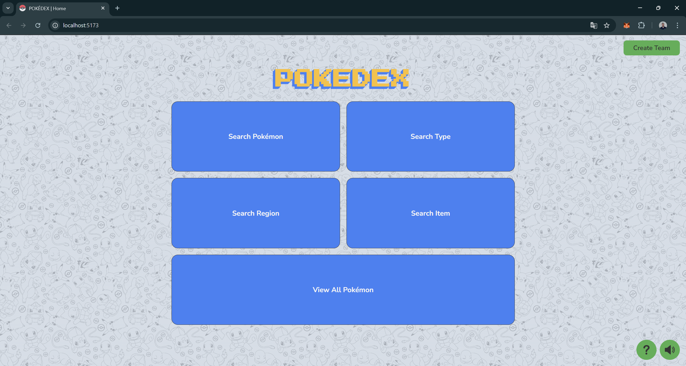
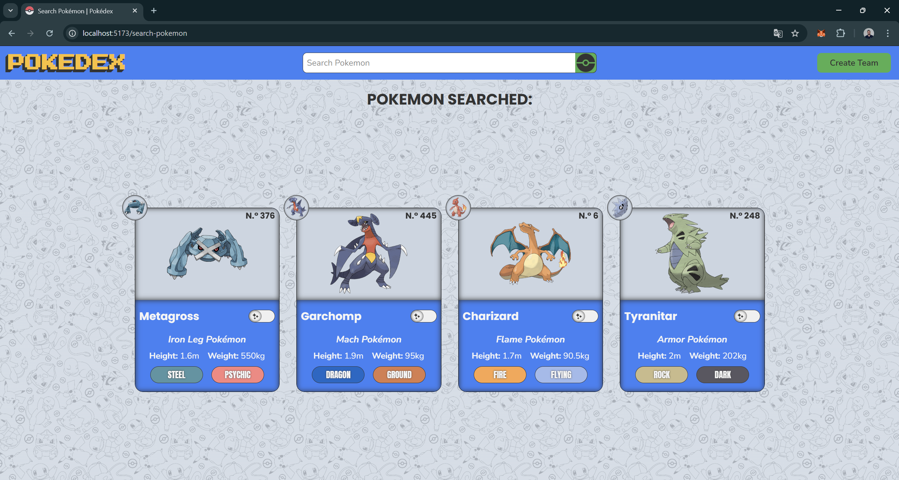
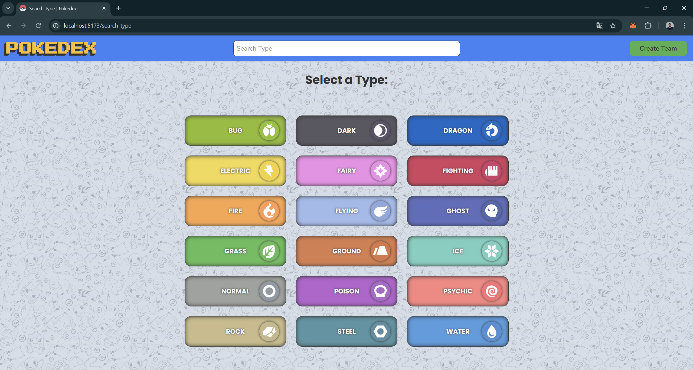
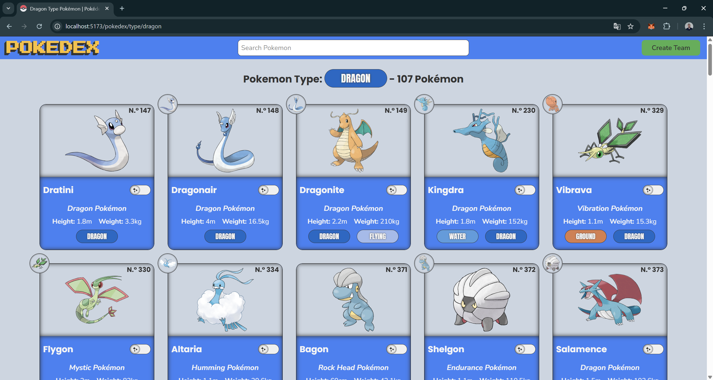

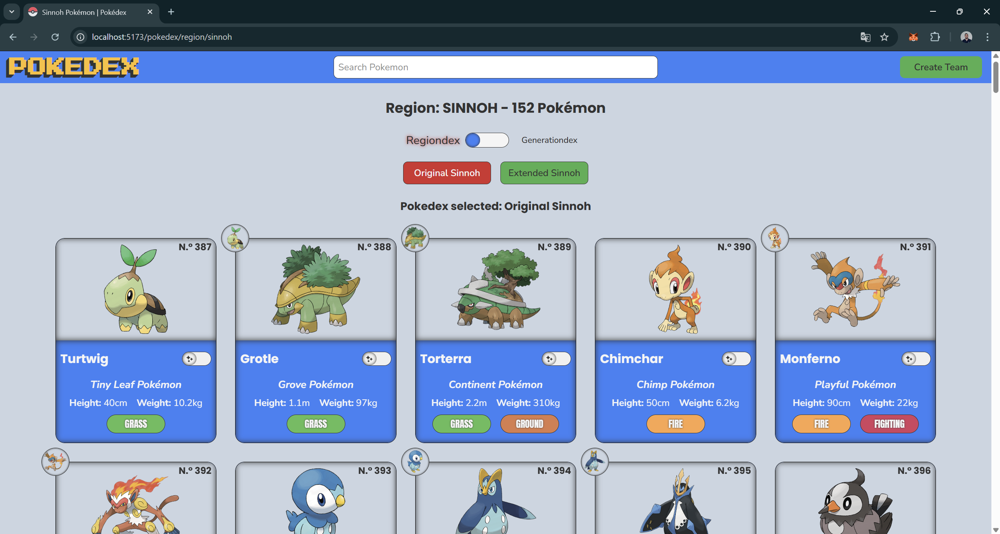
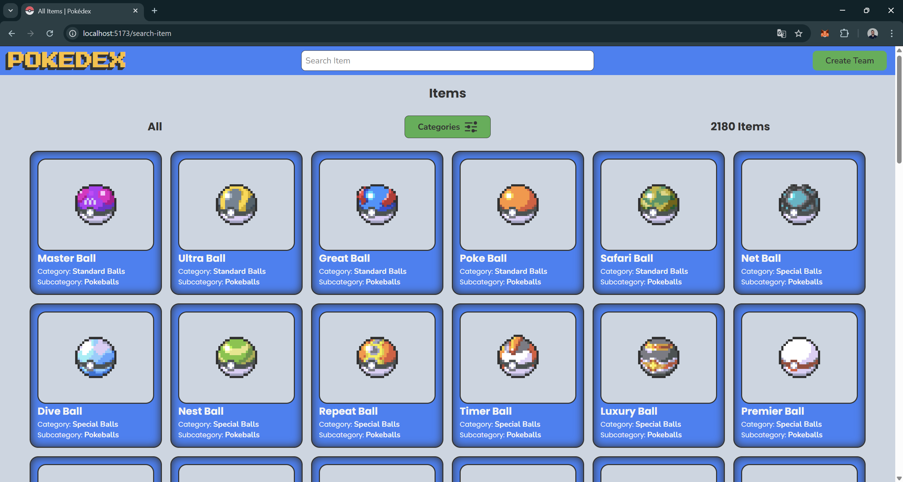
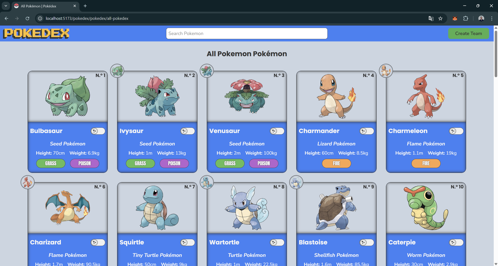
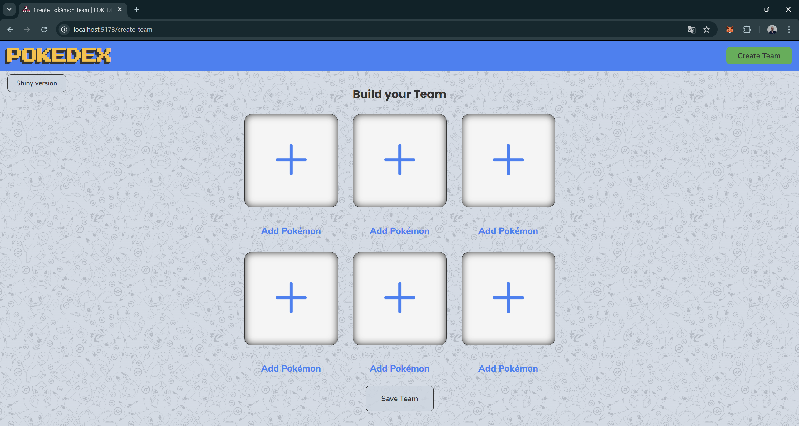
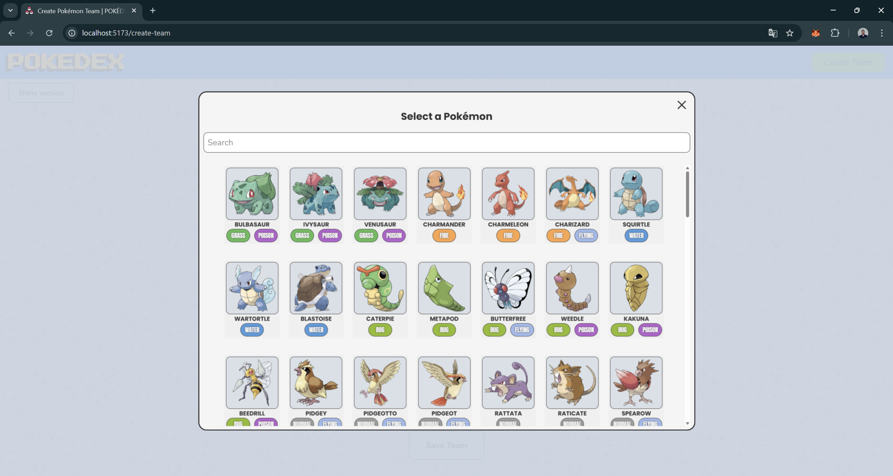
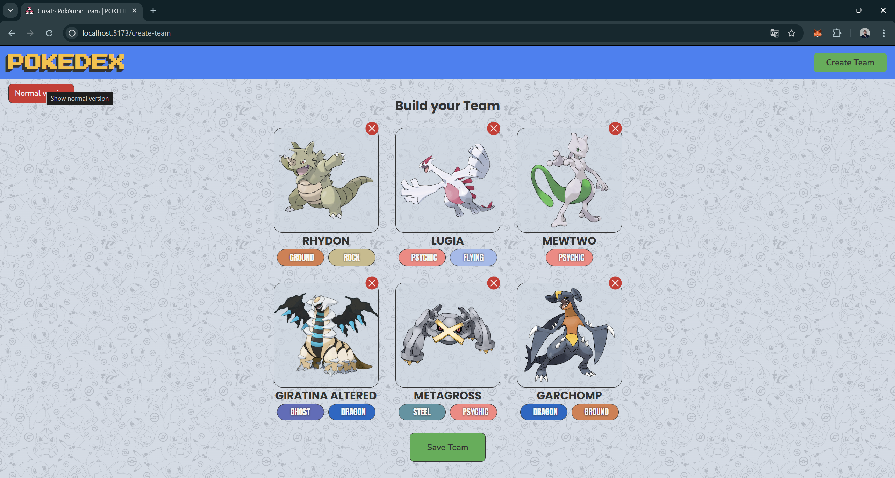
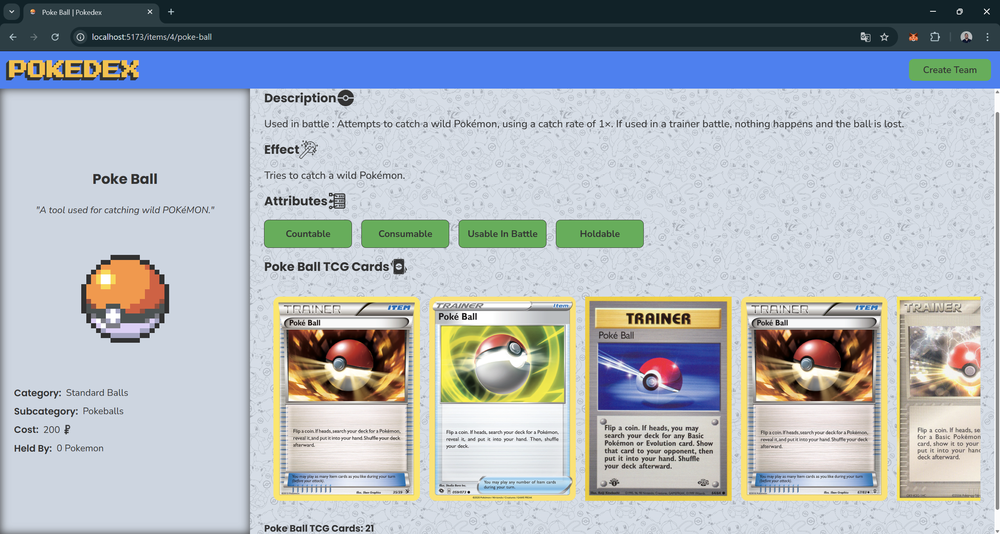
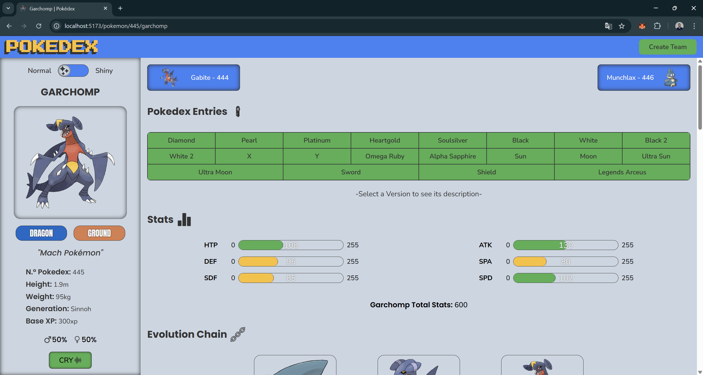
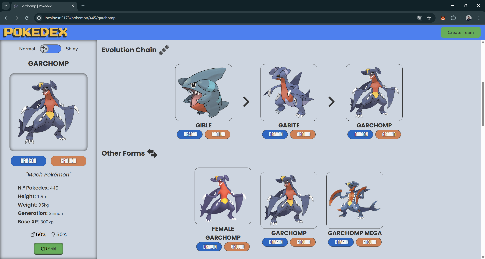
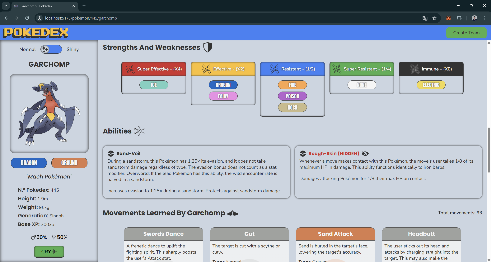
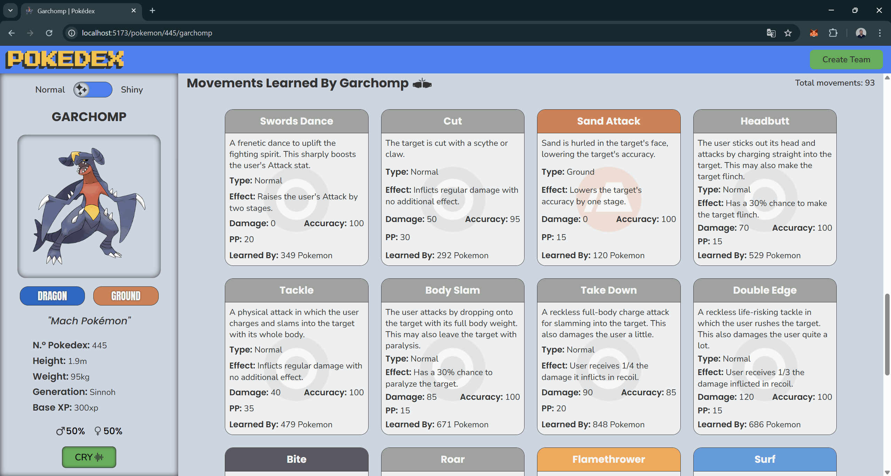
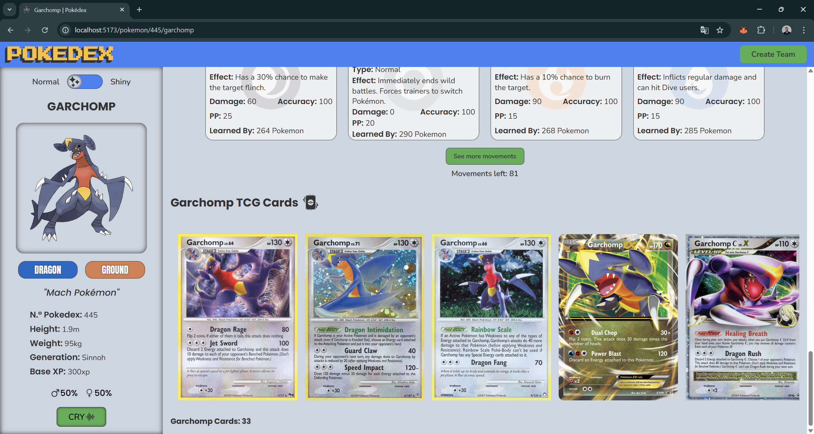

## Tecnologias Utilizadas

  
  
  
  
  
  
  

## Instrucciones de Instalación

- Clonar el repositorio "[https://github.com/Calderon2307/Portafolio_Web](https://github.com/Calderon2307/Portafolio_Web)".
- Acceder a la carpeta "Frontend_PokedexV2_React".
- Abrir el proyecto en una terminal.
- Installar yarn mediante el comando "yarn install".
- Ejecutar el comando "yarn dev".
- Click derecho en el enlace que aparece.
- Seleccionar la opcion "Abrir enlace".

## Otros Proyectos

- [Proyecto 1: Create Elements](https://github.com/Calderon2307/Portafolio_Web/tree/main/Frontend_Create-Elements): Contiene el código y recursos relacionados con el Proyecto 1.
- [Proyecto 2: Animaciones CSS](https://github.com/Calderon2307/Portafolio_Web/tree/main/Frontend_Curso-CSS_Animaciones): Contiene el código y recursos relacionados con el Proyecto 2.
- [Proyecto 3: Primera Web](https://github.com/Calderon2307/Portafolio_Web/tree/main/Frontend_Curso-CSS_Primera-Web): Contiene el código y recursos relacionados con el Proyecto 3.
- [Proyecto 4: Luxury Cars](https://github.com/Calderon2307/Portafolio_Web/tree/main/Frontend_Luxury-Cars): Contiene el código y recursos relacionados con el Proyecto 4.
- [Proyecto 5: Nasa API JS](https://github.com/Calderon2307/Portafolio_Web/tree/main/Frontend_Nasa-API_JS): Contiene el código y recursos relacionados con el Proyecto 5.
- [Proyecto 6: Nasa API React](https://github.com/Calderon2307/Portafolio_Web/tree/main/Frontend_Nasa-API_React): Contiene el código y recursos relacionados con el Proyecto 6.
- [Proyecto 7: Pokedex JS](https://github.com/Calderon2307/Portafolio_Web/tree/main/Frontend_Pokedex_JS): Contiene el código y recursos relacionados con el Proyecto 7.
- [Proyecto 8: Sabores en Reserva](https://github.com/Calderon2307/Portafolio_Web/tree/main/Frontend_Proyecto_Sabores-En-Reserva_React): Contiene el código y recursos relacionados con el Proyecto 8.
- [Proyecto 9: Questions API JS](https://github.com/Calderon2307/Portafolio_Web/tree/main/Frontend_Questions-API_JS): Contiene el código y recursos relacionados con el Proyecto 9.
- [Proyecto 10: Questions API React](https://github.com/Calderon2307/Portafolio_Web/tree/main/Frontend_Questions-API_React): Contiene el código y recursos relacionados con el Proyecto 10.
- [Proyecto 11: The Space](https://github.com/Calderon2307/Portafolio_Web/tree/main/Frontend_The-Space): Contiene el código y recursos relacionados con el Proyecto 11.
- [Proyecto 12: Simple Calculator](https://github.com/Calderon2307/Portafolio_Web/tree/main/Simple-Calculator): Contiene el código y recursos relacionados con el Proyecto 12.
- [Proyecto 14: Task Me! - Backend](https://github.com/Calderon2307/Portafolio_Web/tree/main/Backend_TaskMe): Contiene el código y recursos relacionados con el Proyecto 14.
