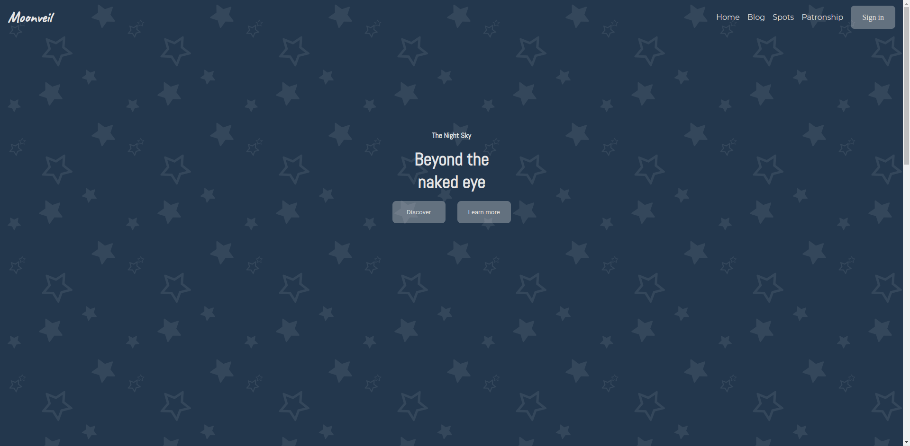
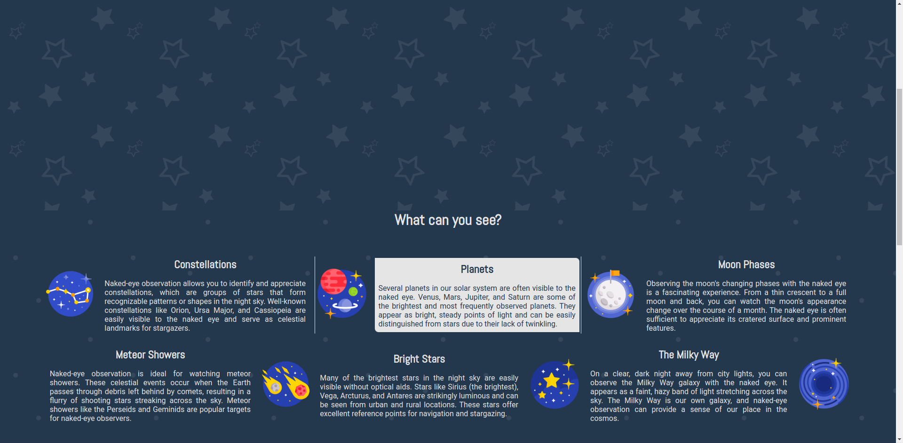
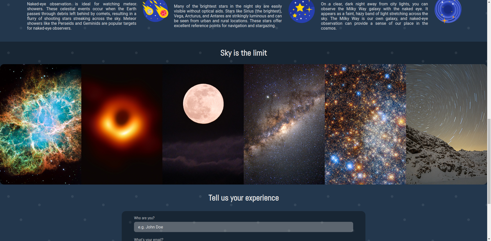
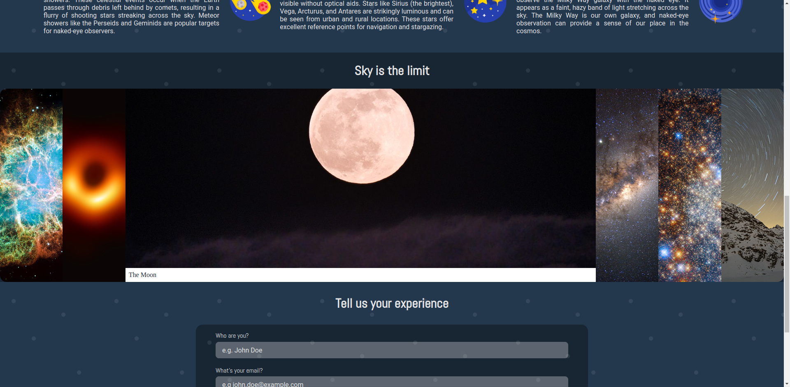
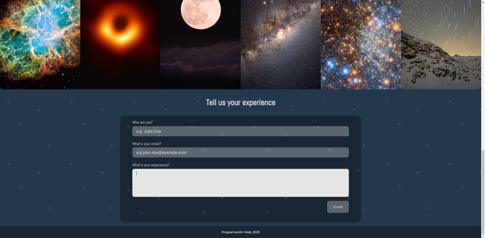

# Proyecto 11: The Space

## Descripción del Proyecto

"The Space" es un proyecto frontend cautivador que ofrece una experiencia interactiva para los usuarios, centrada en mostrar animaciones y elementos visuales atractivos. Diseñado para destacar las habilidades en la creación de experiencias de usuario envolventes, este proyecto presenta una variedad de animaciones y elementos visuales inspirados en el espacio.

## Capturas de Pantalla

## Tecnologías Utilizadas

    
    
    

## Instrucciones de Instalación

- Clonar el repositorio "[https://github.com/Calderon2307/Portafolio_Web](https://github.com/Calderon2307/Portafolio_Web)".
- Acceder a la carpeta "Frontend_The-Space".
- Abrir el archivo "index.html" en el navegador.

## Otros Proyectos

- [Proyecto 1: Create Elements](https://github.com/Calderon2307/Portafolio_Web/tree/main/Frontend_Create-Elements): Contiene el código y recursos relacionados con el Proyecto 1.
- [Proyecto 2: Animaciones CSS](https://github.com/Calderon2307/Portafolio_Web/tree/main/Frontend_Curso-CSS_Animaciones): Contiene el código y recursos relacionados con el Proyecto 2.
- [Proyecto 3: Primera Web](https://github.com/Calderon2307/Portafolio_Web/tree/main/Frontend_Curso-CSS_Primera-Web): Contiene el código y recursos relacionados con el Proyecto 3.
- [Proyecto 4: Luxury Cars](https://github.com/Calderon2307/Portafolio_Web/tree/main/Frontend_Luxury-Cars): Contiene el código y recursos relacionados con el Proyecto 4.
- [Proyecto 5: Nasa API JS](https://github.com/Calderon2307/Portafolio_Web/tree/main/Frontend_Nasa-API_JS): Contiene el código y recursos relacionados con el Proyecto 5.
- [Proyecto 6: Nasa API React](https://github.com/Calderon2307/Portafolio_Web/tree/main/Frontend_Nasa-API_React): Contiene el código y recursos relacionados con el Proyecto 6.
- [Proyecto 7: Pokedex JS](https://github.com/Calderon2307/Portafolio_Web/tree/main/Frontend_Pokedex_JS): Contiene el código y recursos relacionados con el Proyecto 7.
- [Proyecto 8: Sabores en Reserva](https://github.com/Calderon2307/Portafolio_Web/tree/main/Frontend_Proyecto_Sabores-En-Reserva_React): Contiene el código y recursos relacionados con el Proyecto 8.
- [Proyecto 9: Questions API JS](https://github.com/Calderon2307/Portafolio_Web/tree/main/Frontend_Questions-API_JS): Contiene el código y recursos relacionados con el Proyecto 9.
- [Proyecto 10: Questions API React](https://github.com/Calderon2307/Portafolio_Web/tree/main/Frontend_Questions-API_React): Contiene el código y recursos relacionados con el Proyecto 10.
- [Proyecto 12: Simple Calculator](https://github.com/Calderon2307/Portafolio_Web/tree/main/Simple-Calculator): Contiene el código y recursos relacionados con el Proyecto 12.
- [Proyecto 13: Pokedex - V2](https://github.com/Calderon2307/Portafolio_Web/tree/main/Frontend_PokedexV2_React): Contiene el código y recursos relacionados con el Proyecto 13.
- [Proyecto 14: Task Me! - Backend](https://github.com/Calderon2307/Portafolio_Web/tree/main/Backend_TaskMe): Contiene el código y recursos relacionados con el Proyecto 14.
